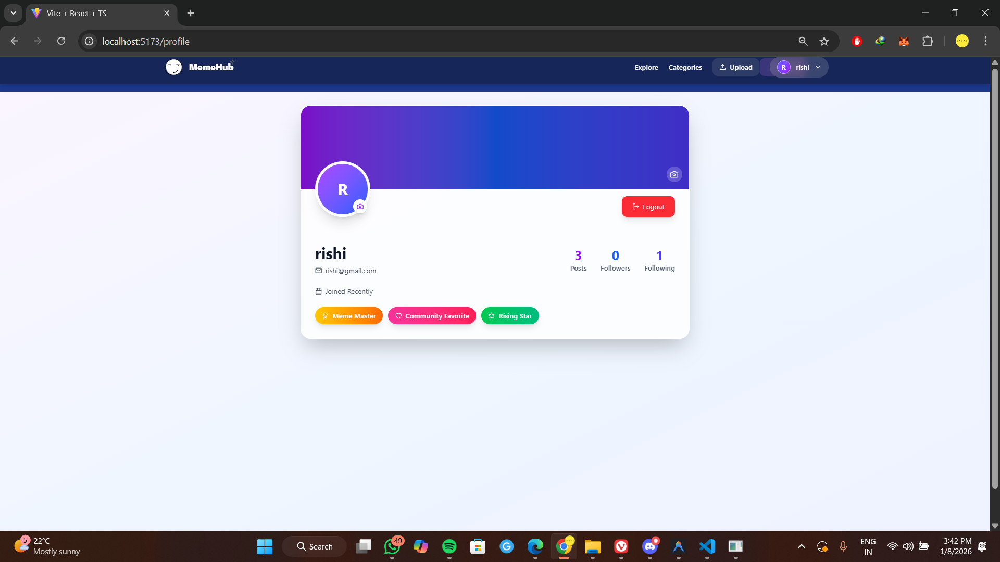
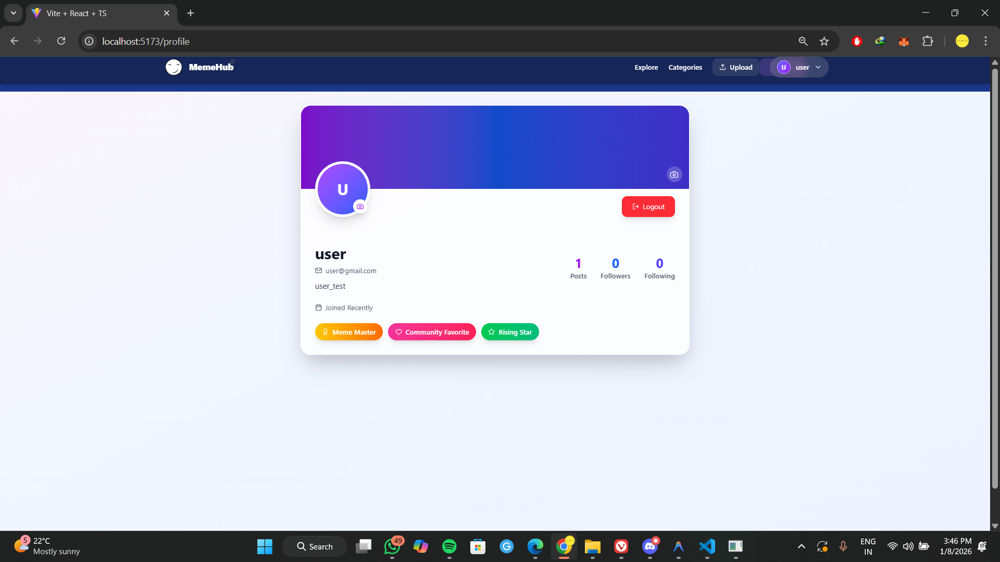
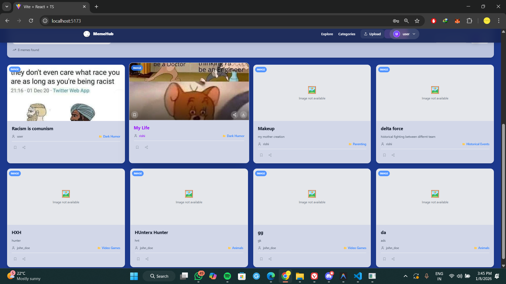

# MemeHub 🎭

MemeHub is a **full-stack meme sharing platform** where users can upload, explore, like, follow, and share memes. Built with a modern UI, backend API, and MySQL database.

## ✨ Features
- User signup & login  
- Profile with bio, stats, and profile pic  
- Followers & following system  
- Upload memes (images, videos, gifs)  
- Like, bookmark, and share memes  
- Explore page with search & filters  
- Categories with vertical slider  
- Modern responsive UI  

## 🛠 Tech Stack
**Frontend:** React + Vite, Tailwind CSS, Framer Motion  
**Backend:** Node.js + Express, MySQL  

## ⚡ Getting Started
1. Clone repo:
   ```bash
   https://github.com/Ri-Verma/MemeHub.git
   ```
### After Cloning the repo configure the .env file in the backend folder below is the structure of the file

- DB_HOST=localhost(locally runniing)
- DB_USER=someuser
- DB_PASSWORD=somepassword
- DB_NAME=somedatabasename
- JWT_SECRET=random_secret_key
- EXPIRATION_TIME=anytime(1D = 1 Day)
- PORT=should_be_the_database_port
   
2. Setup backend:
   ```bash
   cd backend && npm install && npm run dev (or node server.js)
   ```

   
3. Setup frontend:
   ```bash
   cd frontend && npm install && npm run dev
   ```

# 🌐 API Endpoints
## User
- POST /api/users/signup – Register user
- POST /api/users/login – Login user
- GET /api/users/:id – Get user profile
- POST /api/users/:id/follow – Follow a user
- DELETE /api/users/:id/unfollow – Unfollow a user

## Memes
- GET /api/memes – Get all memes
- POST /api/memes – Upload meme
- GET /api/memes/:id – Get meme by ID
- DELETE /api/memes/:id – Delete meme
## 📸 Screenshots

| Login | Profile |
|-------|---------|
|  |  |

| Upload Meme | Explore Page |
|-------------|--------------|
|  |  |


---
### NOTE : (dependicies are depriciated so deploment is not possible for now)

Built with passion by Rishikesh


